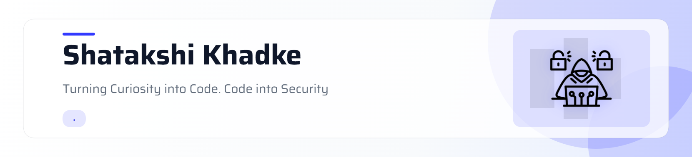

<!-- ============================================================= -->
<!--                  SHATAKSHI KHADKE | README                     -->
<!-- ============================================================= -->

<picture>
  <source media="(prefers-color-scheme: dark)" srcset="https://raw.githubusercontent.com/shatakshikhadke/shatakshikhadke/main/header-dark.png">
  <source media="(prefers-color-scheme: light)" srcset="https://raw.githubusercontent.com/shatakshikhadke/shatakshikhadke/main/header-dark.png">
  

 

# 👋 Hey there, I'm **Shatakshi Khadke**

 

---

# 🛰️ Mission

*"Building practical cybersecurity solutions by integrating Digital Forensics, Security Engineering, Threat Intelligence, Security Operations, Governance, Risk & Compliance, and AI-driven automation to strengthen modern cyber defense."*

---

# 💻 About Me

<table>

<tr>

<td width="65%" valign="top">

## 👨‍💻 Who Am I?

I believe cybersecurity is an interconnected ecosystem rather than isolated domains. Building a broad understanding across DFIR, SOC, Threat Intelligence, GRC, Security Engineering, and Offensive Security enables stronger collaboration, better decision-making, and more effective security solutions.

> **"A jack of all trades is a master of none, but oftentimes better than a master of one."**

This mindset motivates me to continuously learn while developing practical skills through research, engineering, and real-world projects.

### My primary areas of interest include:

- 🔐 Digital Forensics & Incident Response (DFIR)
- 🛡️ Security Operations (SOC)
- 🕵️ Threat Intelligence
- 📋 Governance, Risk & Compliance (GRC)
- 🌐 Network Security
- ⚔️ Vulnerability Assessment & Penetration Testing
- 💻 Security Engineering
- 🐍 Python Development & Automation
- 🤖 AI-assisted Cybersecurity Workflows
- 🔬 Security Research

I enjoy designing practical security tools, automating investigative workflows, and transforming research into solutions that improve modern cyber defense.

</td>

<td width="35%" align="center">

<!-- Replace this with a direct GIF URL (ending in .gif) -->

</td>

</tr>

</table>

---
<h2 align="center">💻 Tech Stack</h2>

  
  
  
  
  
  
  

# 🛡️ Core Competencies

| Domain | Expertise | Tools & Technologies |
|:-------|:----------|:---------------------|
| 🔍 **Digital Forensics** | Mobile, Computer & Network Forensics • Evidence Acquisition • Artifact Analysis | Autopsy • FTK Imager • Cellebrite UFED • EnCase • XRY • Volatility |
| 🛡️ **Security Operations (SOC)** | Log Analysis • Incident Response • Security Monitoring • Detection Engineering | Splunk • Wazuh • Microsoft Defender • Elastic Stack (ELK) • CrowdSec |
| 🕵️ **Threat Intelligence** | IOC Analysis • Threat Research • Intelligence Collection | MITRE ATT&CK • OpenCTI • VirusTotal • MISP |
| 🌐 **Network Security** | Packet Analysis • Network Enumeration • Protocol Analysis | Wireshark • Nmap • TCP/IP • DNS • HTTP/HTTPS • VPN • Firewalls |
| ⚔️ **Offensive Security** | Vulnerability Assessment • Penetration Testing • Web Security Testing | Burp Suite • Metasploit • Gobuster • Hydra • John the Ripper • Hashcat • OWASP ZAP |
| 📋 **Governance, Risk & Compliance** | Risk Assessment • Security Controls • Compliance Frameworks | NIST • ISO/IEC 27001 • CIS Controls |
| 💻 **Security Engineering** | Python Automation • Secure Development • Tool Development | Python • Bash • PowerShell • Git • GitHub • Docker |
| ☁️ **Cloud & AI Security** | Cloud Security Fundamentals • AI-assisted Security Workflows | AWS • Azure • AI Security Fundamentals |

---
# 🌱 Currently Learning

- ☁️ Cloud Security
- 🏗️ DevSecOps
- 🎯 Active Directory
- 🤖 AI-assisted Security Workflows
- 🦀 Rust
- 🧠 Malware Analysis
- 🔐 Detection Engineering
---

# 📜 Certifications

| 🏅 Certification | 🏢 Issued By |
|:-----------------|:-------------|
| 🛡️ Blue Team Junior Analyst (BTJA) | Security Blue Team / Centri |
| 🔵 Certified Blue Team Practitioner (CBTP) | The SecOps Group |
| 🌐 Certified Network Security Practitioner (CNSP) | The SecOps Group |
| 🌍 Certified Junior Web Application Penetration Tester (CJWAPT) | Sturtle Security Pvt. Ltd. |
| ☁️ DevOps & AI on AWS: Upgrading Applications with Generative AI | AWS × Coursera |
| 🔐 Fortinet NSE 2 – Network Security Associate | Fortinet |
| 🌐 Protection from Browser Attacks | VOIS Tech |
| 🔑 IT Support Foundations | Service Desk Simulator

# 📊 GitHub Analytics

## 💡 Philosophy

> **"The strongest cybersecurity professionals aren't defined by a single specialization—they understand how every discipline connects to build resilient security solutions."**

 
